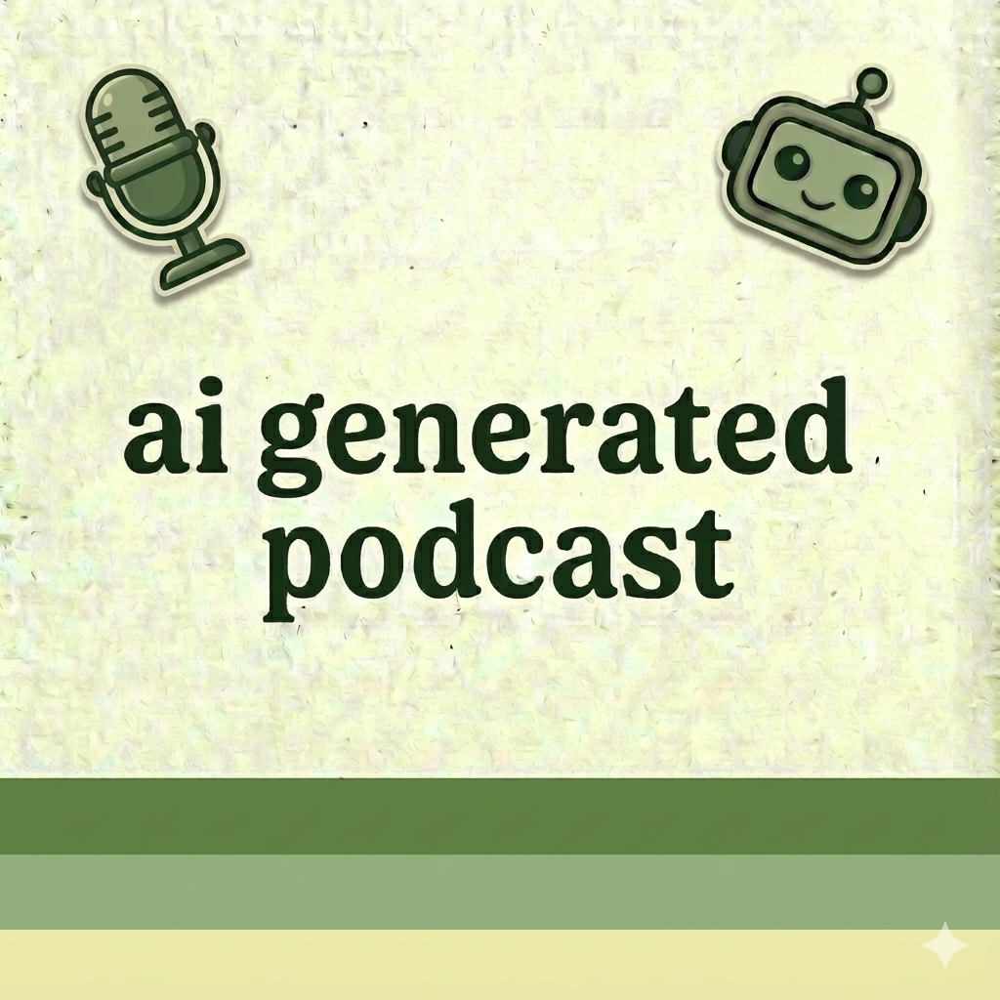

<p align="center">
  
</p>

## AI-Generated Podcast

Generates podcast audio from blog posts using Claude for text cleanup and ElevenLabs for TTS.

**RSS feed:** https://dbirks.github.io/ai-generated-podcast/rss.xml

**Pocket Casts:** https://pocketcasts.com/podcast/ai-generated-podcast/c01659c0-6821-013d-bd77-02e325935ba3

## Setup

```bash
uv sync
cp .env.example .env
# Edit .env with your API keys
```

## CLI Usage

```bash
# Full pipeline: clean text, generate audio, upload to Azure, update feed
uv run main.py episode "Episode Title" --text post.txt --url https://blog.com/post

# Individual commands
uv run main.py tts cleaned.txt -o episode.mp3   # Generate audio with ElevenLabs
uv run main.py upload episode.mp3               # Upload to Azure Blob Storage
uv run main.py feed                             # Regenerate RSS feed
uv run main.py list                             # List all episodes
```

## Adding Episodes

Edit `episodes.yaml`:

```yaml
- title: Episode Title
  published_date: "2024-10-09T00:41:54-04:00"
  blog_url: https://example.com/post
  was_edited: true
  author: Author Name
  article_date: "2024-10-08"
  tech: Claude, ElevenLabs TTS
  description: |
    Episode description here.
    Can be multiline.
```

Then run `uv run main.py feed` to regenerate the RSS feed.

## Architecture

- `main.py` - Typer CLI
- `cleaner.py` - Claude Agent SDK text cleaning
- `tts.py` - ElevenLabs audio generation (auto-chunks at 10k chars)
- `storage.py` - Azure Blob Storage upload
- `feed.py` - RSS feed generation
- `episodes.yaml` - Episode data

## Notes

- ElevenLabs has a 10k character limit per request; `tts.py` auto-chunks and concatenates with ffmpeg
- Medium/similar sites block curl; use browser devtools or manually copy article text
- Files are MP3 but uploaded with `.m4a` extension for podcast app compatibility
